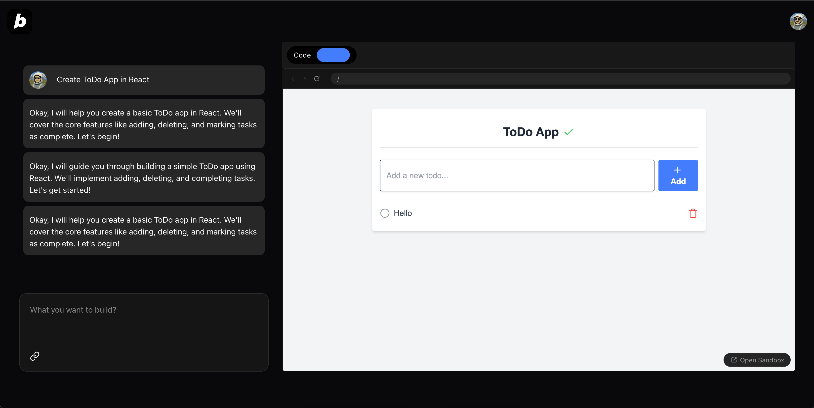

# BoltNewClone



A modern Next.js web application inspired by Bolt, featuring AI-powered chat and code tools, authentication, and workspace management. Built with TypeScript, Convex, and a modular component structure.

## Features

- AI Chat and Code Generation (GEMINI integration)
- User Authentication
- Workspace Management
- Modular UI Components
- Convex backend for real-time data
- Responsive and modern design

## Getting Started

### Prerequisites

- Node.js (v18+ recommended)
- Bun (optional, for faster installs)
- Convex account (for backend)

### Installation

```bash
bun run install # or npm install
```

### Environment Variables

Copy `.env.example` to `.env` and fill in your API keys and configuration.

### Running Locally

```bash
bun run dev # or npm run dev
```

### Convex Setup

1.  Install Convex CLI: `npm install -g convex`
2.  Run `npx convex dev` to start the backend.

# BoltNewClone


BoltNewClone is a modern, TypeScript-based Next.js application inspired by Bolt. It combines AI-powered chat & code tools, user authentication, and workspace management with a Convex backend for real-time data.

## Quick overview

- AI-first chat and code helpers (API routes under `app/api/`)
- User sessions and auth routes
- Workspace-centric UI and components in `components/workspace`
- Convex-powered backend and schema in `convex/`

## Requirements

- Node.js 18+ (or the version compatible with your Next.js setup)
- Bun (optional) or npm/yarn/pnpm for installs
- Convex account (for production/back-end development)

## Quickstart (local)

1. Copy env file and add keys

```zsh
cp .env.example .env
# Open .env and fill required keys (API keys, Convex url, etc.)
```

2. Install dependencies

```zsh
# using bun (recommended if installed)
bun install

# or with npm
npm install
```

3. Start Convex (if you use Convex locally)

```zsh
npx convex dev
```

4. Run the dev server

```zsh
bun dev
# or
npm run dev
```

Open http://localhost:3000 in your browser.

## Environment

Use the `.env.example` file as the authoritative list of variables. Copy it to `.env` and fill values used by your AI integrations and Convex. If you want, add the banner image at `public/banner.png` (or update the path in this README).

## Project structure

```
app/           # Next.js app dir (routes, API handlers, pages)
components/    # UI components (Header, Hero, workspace views)
configs/       # AI model config (e.g. `configs/AIModel.ts`)
context/       # React context providers
convex/        # Convex schema, functions and generated code
data/          # Static data like prompts, lookups, colors
lib/           # Utilities and helpers
providers/     # App-wide providers (Convex client, Theme, Message)
public/        # Static assets (put banner image here)
```

## Notes on Convex

This app uses Convex for real-time storage and server functions. If you don't need Convex during local development you can skip `npx convex dev`, but some features (workspaces, live updates) will be unavailable.

If you plan to deploy, set up a Convex project and point your `.env` to the production Convex URL / keys.

## Development tips

- Replace `public/banner.png` with your project image. The README references that file so GitHub will render it.
- Edit pages in `app/` and components in `components/` — Next 13+ app dir supports fast refresh.
- AI model selection lives in `configs/AIModel.ts`.

## Tests and lints

This template doesn't include a test runner by default. Add your preferred tooling (Jest/Playwright/Testing Library, ESLint) as needed.

## Deployment

- Deploy on Vercel for a frictionless Next.js deployment. Connect your repository and set the environment variables in the Vercel dashboard. If you use Convex, make sure the Convex URL/keys are set in production envs.

## Contributing

Contributions are welcome. Open issues or PRs, describe the change, and include a short test or screenshot where helpful.

---

_Built with Next.js, Convex, and minimal ❤️ by Avik-creator._
